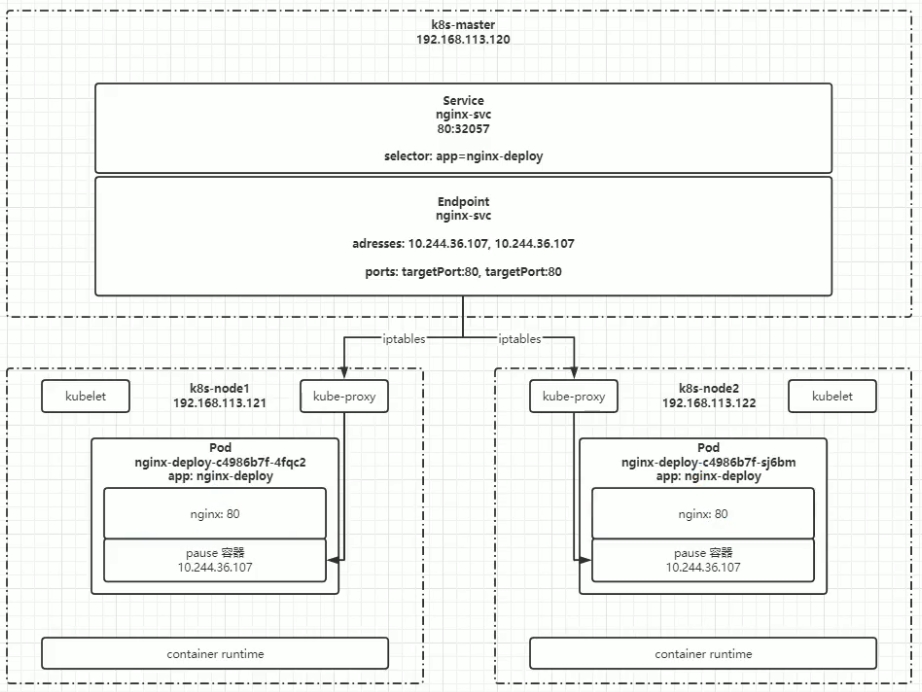

### Pod

- StartupProbe：适用于启动时间较长的应用程序，确保启动过程不会被错误地重启		

- ReadinessProbe：未就绪不会接收外部流量		

- LivenessProbe：用于检测容器是否仍然活着（即容器是否在健康状态下运行），如果 liveness probe 失败，Kubernetes 将会重新启动该容器。这个机制帮助确保应用程序始终处于可用状态		

如果同时配置了 StartupProbe 和 ReadinessProbe，在 StartupProbe 成功之前，ReadinessProbe 和 LivenessProbe 都不会生效。一旦 StartupProbe 成功，后续的探测将由 ReadinessProbe 和 LivenessProbe 接管。		

```yaml		
apiVersion: v1		
kind: Pod		
metadata:		
  name: liveness-http		
spec:		
  containers:		
  - name: myapp		
    image: myapp:latest		
    livenessProbe:		
      httpGet: # 还有tcpSocket（连接端口）、exec.command（执行返回0表示健康）形式		
        path: /healthz		
        port: 8080 # 返回200-400之间的状态码，则认为健康		
    initialDelaySeconds: 3 # 初始化时间		
    timeoutSeconds: 2 # 超时时间		
    periodSeconds: 3 # 监测间隔时间		
    successThreshold: 1 # 检查1次成功就表示成功		
    failureThreshold: 2 # 检查2次失败就表示失败		
```

Pod 的生命周期		


Pod 退出流程		

- Endpoint 删除 pod 的 ip 地址		

- Pod 变成 Terminating 状态：terminationGracePeriodSeconds: 30 中止前宽限期		

- 执行 preStop 的指令		

### Deployment		

set 命令：kubectl set image deployment/nginx busybox=busybox nginx=nginx:1.9.1

`.spec.revisionHistoryLimit`：限制旧 RS 版本保留的数目，在回滚版本时可用

回退版本指定具体版本：kubectl rollout undo deployment/abc --to-revision=3

查看具体版本的信息：kubectl rollout history daemonset/abc --revision=3

### StatefulSet

- Headless Service：对于有状态服务的 DNS 管理

- volumeClaimTemplate：用于创建持久化卷的模板

`kubectl run -it --image busybox:1.28.4 dns-test --restart=Never --rm /bin/sh`进入工具容器查看 启动 pod 的网络状态：

- nslookup web-0.nginx，每个 Pod 的 DNS 格式为 statefulSetName-{0..N-1}.serviceName.namespace.svc.cluster.local
- Headless Service 和 StatefulSet 必须在相同的 namespace

会按名称序号扩缩容：

- kubectl scale statefulset web --replicas=5
- kubectl patch statefulset web -p '{"spec":{"replicas":3}}'

倒序镜像更新（目前不支持直接更新 image， 需要 patch 来间接实现）：

kubectl patch statefulset web --type='json' -p='[{"op": "replace", "path":"/spec/template/spec/containers/0/image", "value":"registry.k8s.io/nginx-slim:0.8"}]'

利用属性 updateStrategy.rollingUpdate.partition 实现灰度发布，只对>=partition的 pod 进行更新

updateStrategy.type: OnDelete 删除时才进行更新

级联删除：默认会同时删除 pods，非级联 kubectl delete sts web --cascade=orphan

### DaemonSet

fluentd 日志收集发送到 ES 中

根据 nodeSelector、nodeAffinity、podAffinity 筛选部署的 node，不设置默认部署到所有工作节点

```yaml
apiVersion: apps/v1 # 现在已不是extensions
kind: DaemonSet
metadata:
  name: fluentd
spec:
  selector:
    matchLabels:
      app: logging # 对应的 DaemonSet pod 的标签
  template:
    metadata:
      labels:
        app: logging
        id: fluentd
      name: fluentd
    spec:
      nodeSelector:
        type: microservice
      containers:
      - name: fluentd-es
        image: agilestacks/fluentd-elasticsearch:v1.3.0
        env:
        - name: FLUENTD_ARGS
          value: -qq
        volumeMounts: # 加载数据卷，避免数据丢失
        - name: varlog # 数据卷的名字
          mountPath: /varlog # 将数据卷挂载到容器内的哪个目录
      volumes: # 定义数据卷
      - hostPath: # 数据卷类型，主机路径的模式，也就是与 node 共享目录
          path: /var/log # node 中的共享目录
        name: varlog # 定义的数据卷名称
```

### HPA

控制管理器通过每隔 horizontal-pod-autoscaler-sync-period 时间查询 metrics 的资源使用情况，常用于 Deployment，DaemonSet 无法使用

支持三种 metrics 类型：

- 预定义的 metrics，比如 CPU
- 自定义的 Pod metrics，以 raw value 的方式计算
- 自定义的 object metrics
  - 控制管理器开启 -horizontal-pod-autoscaler-use-rest-clients
  - 控制器的 -apiserver 指向 API Server Aggregator
  - 在 API Server Aggregator 中注册自定义的 metrics API


预定义资源限制：

```yaml
# Deployment
spec:
  template:
    spec:
      containers:
      - resources:
          limits:
            cpu: 200m
            memory: 128Mi
          requests:
            cpu: 100m # 基于这个配置计算百分比
            memory: 128Mi
```

创建 HPA：kubectl autoscale deploy deploy_name --cpu-percent=20 --min=2 --max=5

kubectl get hpa 获得 HPA 状态

kubectl top pod：需要安装 Metrics API

- 下载 metrics-server 组件配置文件 wget https://github.com/kubemetes-sigs/metricsserver/releases/latest/download/components.yaml -O metrics.server-components.yaml

- 修改镜像地址为国内的地址 sed -i's/k8s.gcr.io\/metrics-server/registry.cn-hangzhoualiyuncs.com\/google_containers/g' metrics-server-components.yaml

- 修改容器的 tls 配置，不验证 tls，在 containers 的 args 参数中增加`--kubelet-insecure-ts`参数
- 安装组件 kubectl apply -f metrics-server-components.yaml

### Service

Service 实现 k8s 集群内部网络调用、负载均衡（四层负载）

Ingress 实现将 k8s 内部服务暴露给外网访问的服务，ingress-nginx 反向代理、负载均衡（七层负载）

kubectl get endpoints

IP 绑定在 pause 容器上



```yaml
spec:
  ports:
  - port: 80 # service 自己的端口，在使用内网 ip 访问时使用
    targetPort: 80 # 目标 pod 的端口
    name: web # 为端口起个名字
    type: NodePort # 随机启动一个端口(30000-32767)，映射到 ports 中的端口，该端口是直接绑定在 node 上的，且集群中的每一个 node 都会绑定这个端口
# 也可以用于将服务暴露给外部访问，但是这种方式实际生产环境不推荐，效率较低，而且 Service 是四层负载，无法处理应用层如 http 协议的header
```

默认协议为 TCP
